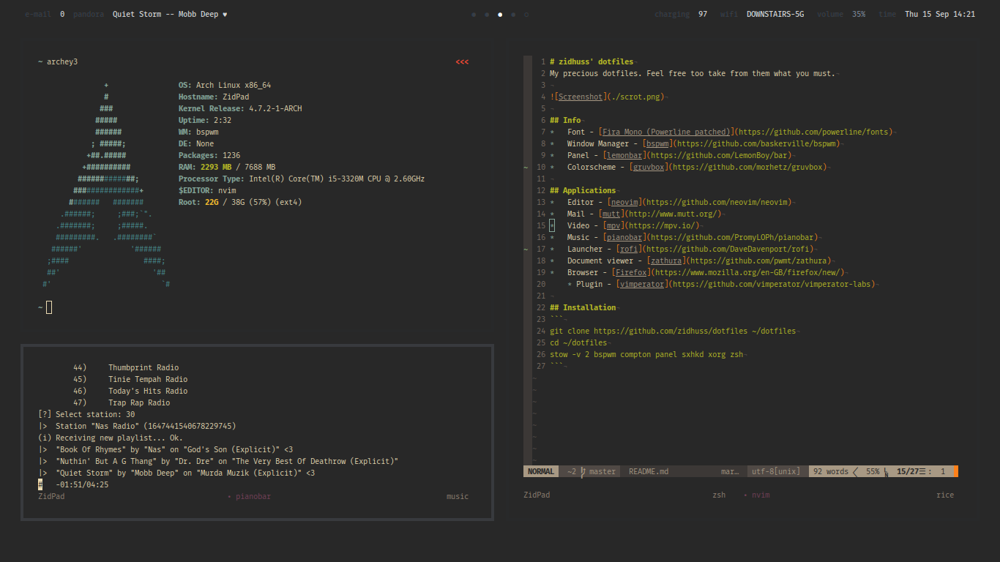

# zidhuss' dotfiles
My precious dotfiles. Feel free to take from them what you must.



## Info
*   Font - [Fira Mono (Powerline patched)](https://github.com/powerline/fonts)
*   Window Manager - [bspwm](https://github.com/baskerville/bspwm)
*   Panel - [lemonbar](https://github.com/LemonBoy/bar)
*   Colorscheme - [gruvbox](https://github.com/morhetz/gruvbox)

## Applications
*   Editor - [neovim](https://github.com/neovim/neovim)
*   Mail - [mutt](http://www.mutt.org/)
*   Video - [mpv](https://mpv.io/)
*   Music - [pianobar](https://github.com/PromyLOPh/pianobar)
*   Launcher - [rofi](https://github.com/DaveDavenport/rofi)
*   Document viewer - [zathura](https://github.com/pwmt/zathura)
*   Browser - [Firefox](https://www.mozilla.org/en-GB/firefox/new/)
    * Plugin - [vimperator](https://github.com/vimperator/vimperator-labs)

## Installation
```
git clone https://github.com/zidhuss/dotfiles ~/dotfiles
cd ~/dotfiles
stow -v 2 bspwm compton panel sxhkd xorg zsh
```
